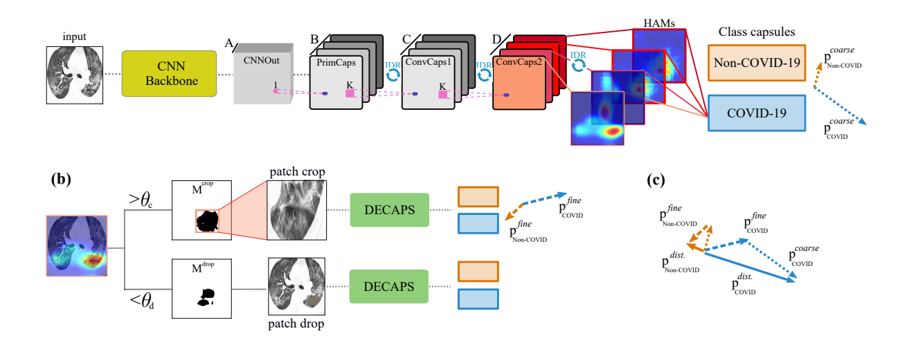

# Detail-oriented Capsule Network
Official PyTorch implementation of the Detail-oriented Capsule Network (DECAPS) proposed in 
the paper [Radiologist-Level COVID-19 Detection Using CT Scans with Detail-Oriented Capsule Networks](https://arxiv.org/pdf/2004.07407.pdf).


*Fig1. Detail-oriented Capsule Network architecture for COVID-19 Detection from CT scans*


## Dependencies
- Python (3.5 preferably; should also works fine with python 2.7)
- NumPy
- [PyTorch](https://pytorch.org/)>=1.1
- [torchvision](https://pytorch.org/)>=0.3
- [Tensorflow](https://github.com/tensorflow/tensorflow)>=1.10 (for visualizations with Tensorboard)
- Matplotlib (for saving images)


## How to run the code

### 1. Prepare your data
The COVID-19 CT dataset is currently available [Here](https://github.com/UCSD-AI4H/COVID-CT). 
By April 17th of 2020,  it
contains a total of 746 chest CT images, which are divided
into two classes, namely COVID-19 and non-COVID-19. Instructions on 
preparing the data for the model will be prepared and uploaded soon. 

### 2. Train
Most of the network hyper-parameters can be found in ```config.py``` file. You may modify them or run with
the default values which runs the DECAPS proposed in the paper.


Training the model displays the training results and saves the trained model if an improvement observed in the accuracy value.
- For training with the default setting: ```python train.py ```
- For training with a different batch size: ```python train.py --bs=16```

### 3. Test:
- For running the test: ```python inference.py --load_model_path=/path/to/saved/model```
where ```load_model_path``` is the path to the desired .ckpt file.


